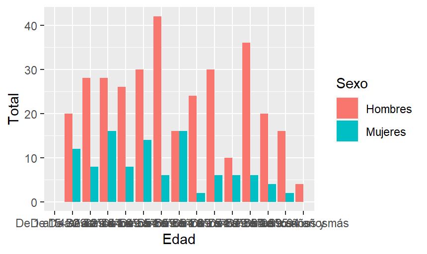

---
title: "Análisis de datos de suicidio nacionales"
author: "Rocío Alonso, Celia Valladolid, Andrés Gómez"
date: "11/12/2021"
output: html_document
---

```{r setup, include=FALSE}
knitr::opts_chunk$set(echo = TRUE)
```

# Presentación del proyecto

Presentamos nuestro proyecto sobre **ánalisis de datos de fallecimientos a nivel nacional** de 2019 en comparación con los datos mundiales y con los de Castilla y León, centrándonos sobretodo en los datos referentes a muertes debidas a __suicidio o a lesiones autoinfligidas__.

## Obtención de los datos

Todos los datos trabajados en este proyecto han sido extraídos de las bases de datos contenidas por el *INE* (Instituto Nacional de Estadística) y los _datos gubernamentales_, que están disponibles al ser datos abiertos. 

Los datos en cuestión pueden encontrarse también subidos en el repositorio en que se encuentra nuestro proyecto en GitHub, y son los correspondientes a:

+ Muertes en España entre 1980 y 2019
+ Muertes en Castilla y León en 2019 y 
+ Muertes a nivel mundial en 2019.

<https://datos.gob.es/es/catalogo>.

## Métodos de análisis de datos
### Importación de los datos
El primer paso que hemos llevado a cabo ha sido la **descarga e importación de los datos** en nuestro proyecto, con un código similar al siguiente que tiene como única variación los nombres de los datos importados.
```{r eval=FALSE}
Nacionales_historico <- read_delim("6609.csv", 
                      delim = ";", escape_double = FALSE, trim_ws = TRUE)

Nacionales_historico
summary(Nacionales_historico)
View(Nacionales_historico)
```

### Separación de datos por categorías
La __separación de datos__ en los tres diferentes trabajados ha sido llevada a cabo de manera muy similar, filtrando cada base de datos en función de sus características para obtener datos generales ya interpretables para comenzar a graficar.

### Separación por causa
Al haber interpretado todos los datos de fallecimiento de todas las maneras posibles con los datos trabajados, hemos procedido a **filtrar por causa de la muerte** dejando únicamente los datos relacionados con el suicidio para proceder a su interpretación.

### Creación de gráficos
Por último hemos y con el propósito de llevar a cabo una interpretación de los datos más relevantes por separado, hemos __graficado__ algunos ejemplos para ilustrar las conclusiones que queremos exponer.

#### Estudio datos internacionales
Al estudiar los datos internacionales encontramos problemas con los datos de ciertos países, que resultan inverosímiles o inexistentes, además de que algunos países marcan los decimales distinto, por lo que las cifras parecen mucho más altas de lo que realmente son, debido a esto estudiamos sólo los datos referentes a 5 países, encontrando entre ellos variaciones continentales y de nivel socioeconómico, para que aún siendo una muestra demasiado pequeña como para extraer conclusiones, sea relevante.

```{r internacional, echo=FALSE, fig.cap="A caption", out.width = '100%'}
knitr::include_graphics("tasas_internacionales.png")
```

#### Estudio datos Castilla y León
En el caso de los datos referentes a Castilla y León hemos querido incidir en la separación por sexo y edad, los datos revelan una significativamente mayor tasa de suicidio dentro del sexo masculino, y unos datos que no coinciden con las pirámides poblacionales referentes a Castilla y León en 2019, dado que encontramos una tasa mucho más alta de lo esperable en edades relativamente jóvenes.

```{r cyl, echo=FALSE, fig.cap="A caption", out.width = '100%'}

```

#### Estudio datos nacionales
A la hora de trabajar con los datos nacionales hemos tomado la decisión de filtrar los datos posteriores a 2005, dado que los anteriores sospechamos que son una acumulación puesto que son cifras dudosas.

La decisión tomada finalmente es estudiar los datos divididos por sexos en función del año, y estos datos muestran que el suicidio se mantiene como una causa de muerte más presente en la población masculina y en los últimos años aumenta la tasa de suicidios general.

```{r nacional, echo=FALSE, fig.cap="A caption", out.width = '100%'}

```


## Interpretación de los datos
 Pese a que los datos no están suficientemente analizados como para sacar conclusiones contundentes, este análisis de datos nos permite concluir que **el suicidio es una causa de muerte que se incrementa con el paso de los años**, se da especialmente en __hombres__, cada vez más en **jóvenes** y más en **países con niveles socioeconómicos medios-altos**, además de ser una causa de muerte de la cual muchos países no parecen hacer públicos datos fiables.
 
 Con estas conclusiones defendemos que el suicidio debe dejar de ser un tabú social, y se deben hacer campañas de prevención y apoyo a la salud mental, especialmente en jóvenes y en varones.
 
 Algunos enlaces de interés sobre el tema trabajado y de carácter informativo o de apoyo:
 
+ <https://medlineplus.gov/spanish/ency/article/001554.htm>.
+ <https://www.mayoclinic.org/es-es/diseases-conditions/suicide/in-depth/suicide/art-20044707>.
+ <https://www.who.int/es/news-room/fact-sheets/detail/suicide>.
+ <https://childmind.org/es/articulo/suicidio-en-adolescentes-cuales-son-los-factores-de-riesgo/>.
+ <https://telefonodelaesperanza.org/>.
